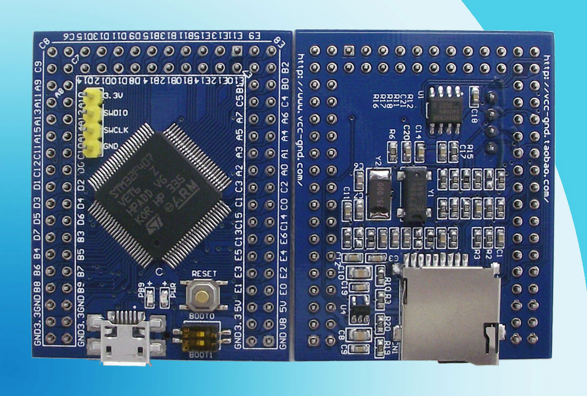

# VCC GND STM32F407VET6 Mini

MicroPython board definition files for the STM32F407VET6 Mini board from [VCC-GND](http://vcc-gnd.taobao.com).



You can buy one for around $12 USD on [AliExpress](https://www.aliexpress.com/item/STM32F407VET6-Mini-version-of-the-core-board-STM32-minimum-system-version/32709285751.html)

Clone the board definitions to your [MicroPython](https://github.com/micropython/micropython) ports/stm32/boards folder.

```
cd micropython/ports/stm32/boards
git clone https://github.com/mcauser/VCC_GND_F407.git
```

### Build the firmware:

```
cd micropython/ports/stm32
make BOARD=VCC_GND_F407
```

### Instructions for Mac OSX

To upload, I used a $2 USD [ST-Link V2 clone](https://www.aliexpress.com/item/FREE-SHIPPING-ST-Link-V2-stlink-mini-STM8STM32-STLINK-simulator-download-programming-With-Cover/32242036342.html) with `arm-none-eabi-gdb`

Install packages

```
brew install stlink
brew cask install gcc-arm-embedded
```

Check if ST-LINK V2 device is found.
(plug it into a free USB port)

```
st-info --probe
Found 1 stlink programmers
```

Connect ST-LINK V2 to VCC-GND STM32F407VET6 dev board

```
ST-LINK V2 -- STM32F407VET6
3.3V -------- 3v3
SWDIO ------- DIO
SWCLK ------- SCK
GND --------- GND
```

Open two Terminals, one for `st-util` and the other to compile and upload.

Open the first terminal and run

```
st-util
```

It should say "Listening at *:4242..."

Open the second terminal and run:

```
cd micropython/ports/stm32
make BOARD=VCC_GND_F407
arm-none-eabi-gdb build-VCC_GND_F407/firmware.elf
```

Inside gdb run:

```
(gdb) target extended localhost:4242
(gdb) load
(gdb) exit
```

LEDs will blink as the firmware is uploaded.

Switch back to the `st-util` Terminal

```
Look for "Flash written and verified! jolly good!"
```

Press Ctrl+C to exit

Disconnect ST-LINK from USB
Disconnect ST-LINK from dev board (3V3,SWDIO,SWCLK,GND)

Run MicroPython on the board
Connect to the dev board using Micro USB cable (make sure ST-LINK is disconnected to avoid blue smoke!)

```
screen /dev/tty.usbmodem1412 115200
or
screen /dev/tty.usbmodem1422 115200
```

Not sure which? Use tab completion `screen /dev/tty.usb` Tab Tab.

To exit screen: Ctrl+a Ctrl+\ y

Be sure to eject the PYBFLASH mount before unplugging the board.

Success!

```
MicroPython v1.8.7-4-g51a4473-dirty on 2017-01-13; VCC-GND STM32F407 with STM32F407
Type "help()" for more information.
>>>
```

Your board is now running MicroPython!

```
>>> machine.info()
ID=30003500:06473332:32333338
S=168000000
H=168000000
P1=42000000
P2=84000000
_etext=80650e4
_sidata=80650e4
_sdata=20000000
_edata=20000164
_sbss=20000164
_ebss=200027fc
_estack=20020000
_ram_start=20000000
_heap_start=200027fc
_heap_end=2001c000
_ram_end=20020000
qstr:
  n_pool=0
  n_qstr=0
  n_str_data_bytes=0
  n_total_bytes=0
GC:
  102016 total
  432 : 101584
  1=14 2=5 m=3
LFS free: 86528 bytes

The AT24C08 EEPROM on I2C1
>>> i2c = machine.I2C(1)
>>> i2c.scan()
[80, 81, 82, 83]

Toggle blue led
>>> led = pyb.LED(1)
>>> led.on()
>>> led.off()

>>> import gc
>>> gc.mem_free()
97456
>>> gc.mem_alloc()
4640

>>> pyb.rng()
780383225

>>> pyb.millis()
1708543

>>> rtc = pyb.RTC()
>>> rtc.datetime((2017, 1, 13, 14, 45, 0, 0, 0))
>>> rtc.datetime()
(2017, 1, 13, 6, 5, 0, 1, 204)

>>> adc = pyb.ADC(pyb.Pin.board.PA1)
>>> adc.read()
```

### Flashing via DFU

This board can also be flashed using DFU. To put the board in DFU mode, slide
the BOOT0 DIP switch (number 2) to the ON position and press RESET.

Now you can flash the board using USB with the command
`make BOARD=VCC_GND_F407 deploy`. Once the board is flashed, slide BOOT0 back
to the original position.

You can use the Micropyton command `pyb.bootloader()` to get into DFU mode
without needing to use the switch.

Currently, you need to unplug and replug the board in order to switch from DFU
mode to regular mode.

### Specifications:

* STM32f407VET6 ARM Cortex M4
* 168MHz, 210 DMIPS / 1.25 DMIPS / MHz
* 1.8V - 3.6V operating voltage
* 25MHz system crystal (NX5032GA)
* 32.768KHz RTC crystal
* AT24C08 I2C EEPROM 1024 Byte x 8, 400KHz
* 2.54mm pitch pins
* JTAG/SWD header
* 512KByte Flash, 192 + 4 KByte SRAM
* 3x SPI, 3x USART, 2x UART, 2x I2S, 3x I2C
* 1x FSMC, 1x SDIO, 2x CAN
* 1x USB 2.0 FS / HS controller (with dedicated DMA)
* 1x USB HS ULPI (for external USB HS PHY)
* Micro SD
* 1x 10/100 Ethernet MAC
* 1x 8 to 12-bit Parallel Camera interface
* 3x ADC (12-bit / 16-channel)
* 2x DAC (12-bit)
* 12x general timers, 2x advanced timers
* RT9193-3.3V: 3.3V LDO voltage regulator, max current 300mA
* Micro USB for power and comms
* User LED (PB9)
* 2x DIP switch for bootloader selection
* Reset button
* 2x18 side pins + 2x10 top pins + 1x4 debug pins
* Dimensions: 49.53mm x 39.37mm

### Modifications:

* change HSE_VALUE from 8000000 to 25000000
* change PLL_M from 8 to 25

### Links:

* [STM32F407VE on st.com](http://www.st.com/content/st_com/en/products/microcontrollers/stm32-32-bit-arm-cortex-mcus/stm32-high-performance-mcus/stm32f4-series/stm32f407-417/stm32f407ve.html)
* [Buy on AliExpress](https://www.aliexpress.com/item/New-STM32F407VET6-Mini-version-of-the-core-board-STM32-minimum-system-board/32809309613.html) or search for "STM32F407VET6 Mini"
* [Buy on Taobao](https://world.taobao.com/item/523361737493.htm)
